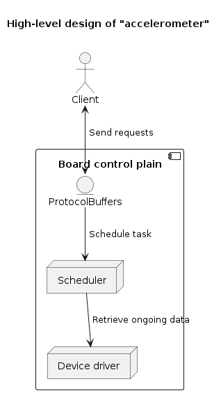

# light-detector


[](https://github.com/vshymanskyy/StandWithUkraine/blob/main/docs/README.md)

## General Information

A driver-like application, which allows to communicate with **LIS2DW12** accelerometer sensor, based on **STM32L476RG** embedded system.

Includes following features:
* Retrieve latest sensor data(**raw**)



## Setup

All setup related operations are processed via **Makefile** placed in the root directory.

First of all connect your board to the serial port.

In order to build **IOC** project it's required to **CubeMX** to generate **ELF** upload it with the help of
**STM Programmer**.

> If **ProtocolBuffers** files need to be regenerated it's required to execute the following command:
```shell
make generate
```

## Scripts

### CLI

Detailed documentation can be found [here](./Scripts/cli/README.md)
