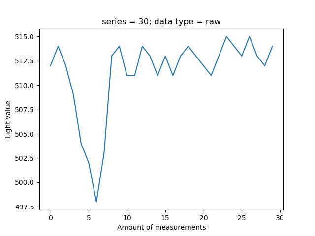
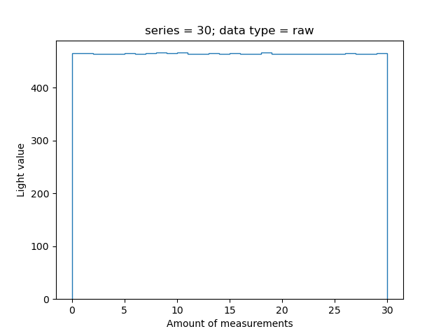
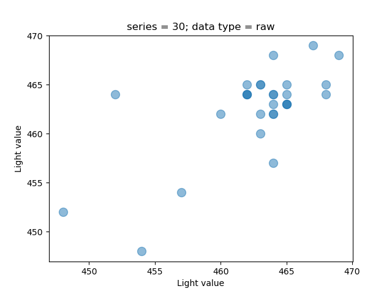

# CLI


[](https://github.com/vshymanskyy/StandWithUkraine/blob/main/docs/README.md)

## General Information

Allows to perform operations with serial connected devices.

Includes following features:
* Retrieve latest sensor data(**raw**)

All the operations are perform with the usage of **ProtocolBuffers**.

## Setup

First of all connect your board with device installed to serial port. Your board needs to have
already installed software build, which allows communication with **LIS2DW12** device.


All setup related operations are processed via **Makefile** placed in the root directory.

In order to build the project it's required to execute the following command. It generates local **Python** project.
```shell
make install
```

# Use Cases

Most of the commands given below require **baud rate**. It is important to be the exact-supported value,
otherwise requests will be ignored(in the given examples baud rate is equal to **9600**).

## Get Available Devices

The example below shows how to retrieve a set of all available devices, which can be used to perform other operations.
```shell
$ light-detector-cli get_available_devices

[
  instance(AvailableDevicesDto):
    description: 'STM32 STLink',
    location: '/dev/cu.usbmodem1203',
    manufacturer: 'STMicroelectronics'
]
```

## Get data

The examples below show all the possible ways to retrieve data information from the board.

```shell
$ light-detector-cli get_data --device="/dev/cu.usbmodem1203" --baud_rate="9600" --type="raw"

[
  instance(RetrievedDataDto):
    data_type: <DataTypeCompound.RAW: 'Raw'>,
    device_id: 44,
    nonce: 1,
    value: instance(RawDataTypeValue):
      x: 1,
      y: 1,
      z: 1
]
```

In the same way other types of data can be retrieved, all the available data types are given below:
* raw

It's also possible to have a series of measurements, in order to archive that it's important to add **series** parameter.

```shell
$ light-detector-cli get_data --device="/dev/cu.usbmodem1203" --baud_rate="9600" --type="raw" --series=4

[
  instance(RetrievedDataDto):
    data_type: <DataTypeCompound.RAW: 'Raw'>,
    device_id: 44,
    nonce: 1,
    value: instance(RawDataTypeValue):
      x: 1,
      y: 1,
      z: 1
  instance(RetrievedDataDto):
    data_type: <DataTypeCompound.RAW: 'Raw'>,
    device_id: 44,
    nonce: 2,
    value: instance(RawDataTypeValue):
      x: 1,
      y: 1,
      z: 1
  instance(RetrievedDataDto):
    data_type: <DataTypeCompound.RAW: 'Raw'>,
    device_id: 44,
    nonce: 3,
    value: instance(RawDataTypeValue):
      x: 1,
      y: 1,
      z: 1
  instance(RetrievedDataDto):
    data_type: <DataTypeCompound.RAW: 'Raw'>,
    device_id: 44,
    nonce: 4,
    value: instance(RawDataTypeValue):
      x: 1,
      y: 1,
      z: 1
]
```

Having a series of measurements it becomes possible to create a diagram to more easily observe output changes. In
order to do that it's needed to add **export**(describes a location of output diagram file) and **figure**(describes a type of the diagram)
parameters.

```shell
$ light-detector-cli get_data --device="/dev/cu.usbmodem1203" --baud_rate="9600" --type="raw" --series=4 --export="./output" --figure="plot"

...
```

Available **figure** values:
* plot
* stairs
* scatter

#### Plot



#### Stairs



#### Scatter

